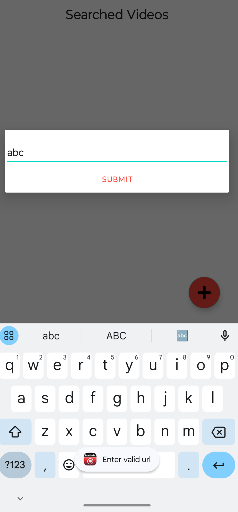
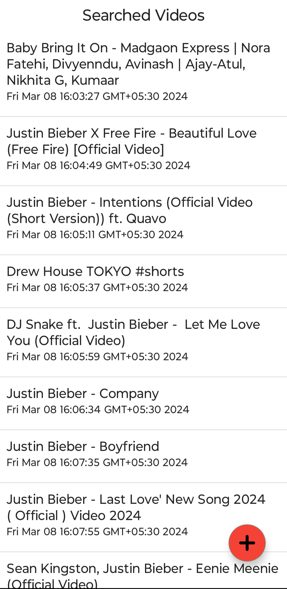
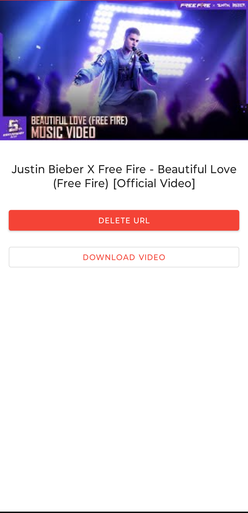
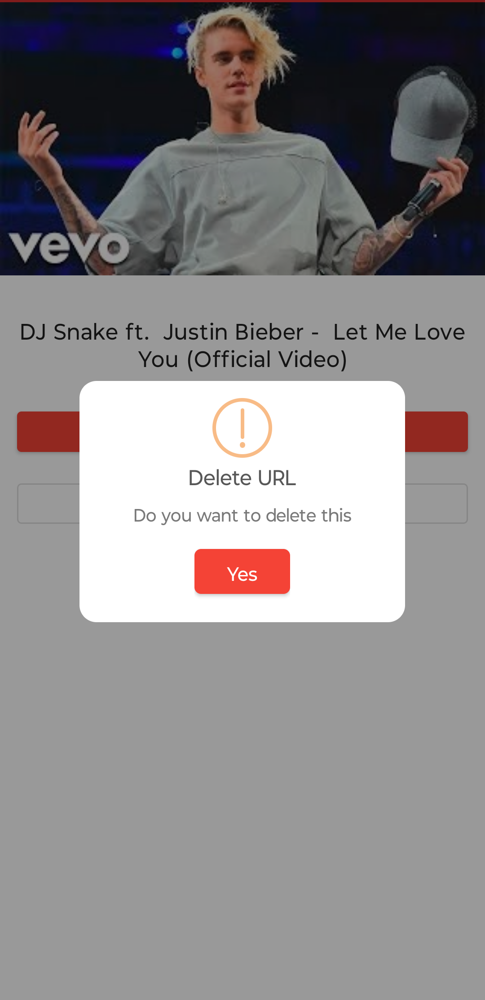
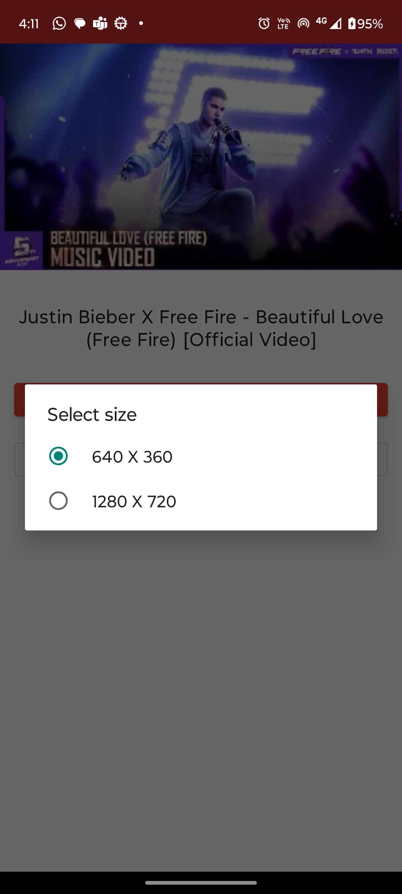
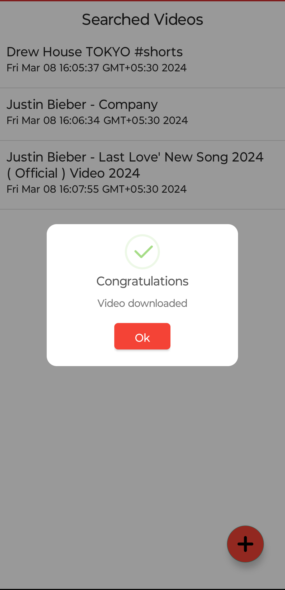

# YoutubeDownloader

# About
YouTubeDownloader is a versatile application that allows users to download videos from YouTube onto their Android devices. With a user-friendly interface and robust functionality, this app provides a convenient solution for downloading and managing your favorite YouTube videos.

# Features

<b>Video Downloading:</b> Download videos from YouTube in various formats and qualities.

<b>Video Management:</b> Organize and manage downloaded videos within the app.

<b>Background Downloading:</b> Download videos even while the app is running in the background.

<b>Batch Downloading:</b> Download multiple videos simultaneously for greater efficiency.

<b>Offline Playback:</b> Watch downloaded videos offline without an internet connection.

# Tools Used
1. Android Studio IDE
2. MVVM Architecture
3. Hilt and Dagger
4. Room Database Library
5. DownloadManager
6. Volley Library

# Installation
You can install this application to test on your android smartphone. To download the signed application go to your chrome browser and copy-paste the download link:

https://github.com/Rahula-12/YoutubeDownloaderApp/releases/download/download/YoutubeDownloader.apk

Download will be started automatically. After then install it on your android device. Open the application, download the youtube videos and enjoy! That's it.

N.B: It supports only in android version 5.0 or later.

# Preview

# Contribution
Contributions are welcome! If you'd like to contribute to this project, please follow these guidelines:

Fork the repository and create a new branch.
Make your changes and test them thoroughly.
Submit a pull request detailing the changes you've made.

# License
This project is licensed under the MIT License.

# Acknowledgements
This project utilizes the <a href="https://rapidapi.com/ytjar/api/ytstream-download-youtube-videos">YTStream API</a> for fetching video data.

